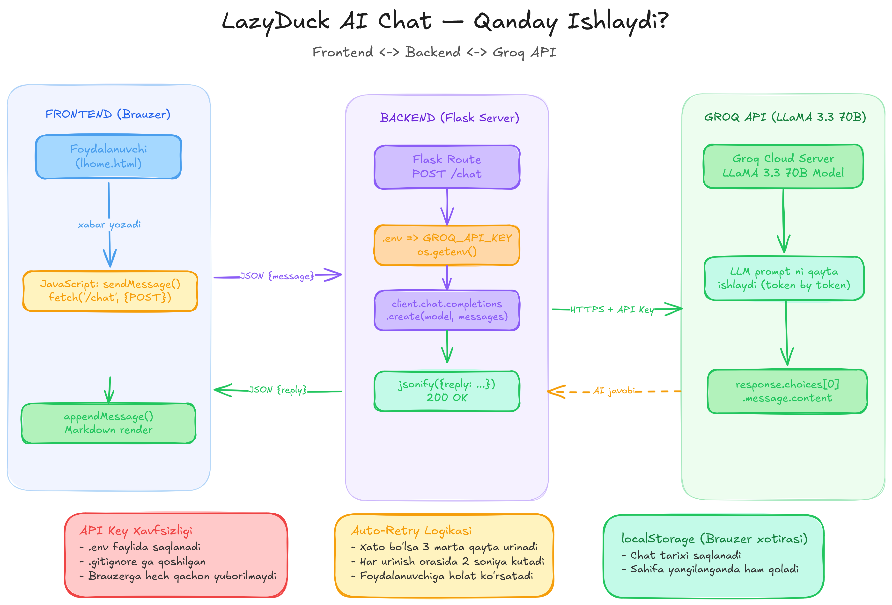

# Private AI Chat

> 🇺🇿 [O'zbek tilida o'qing!!!](#-ozbek-tilida) | 🇷🇺 [Читать на русском](#-на-русском) | 🇬🇧 [Read in English](#-in-english)

---

## 🇺🇿 O'zbek tilida

Python (Flask) va Groq AI yordamida qurilgan oddiy AI chat veb ilovasi.

### Loyiha tuzilmasi

```
private-ai/
├── app.py               # Flask backend (asosiy server fayl)
├── templates/
│   └── LHome.html       # Frontend (chat sahifasi)
├── static/
│   └── style.css        # Dizayn fayli
├── requirements.txt     # Kerakli kutubxonalar ro'yxati
├── .env                 # Maxfiy API kalit (GitHub ga yuklanmaydi!)
└── .gitignore           # Git e'tiborsiz qoldiradigan fayllar
```

### Ishga tushirish

**1. Reponi clone qilish**
```bash
git clone https://github.com/YOUR_USERNAME/private-ai.git
cd private-ai
```

**2. Kutubxonalarni o'rnatish**
```bash
pip install -r requirements.txt
```

**3. API kalitni sozlash**
- [groq.com](https://console.groq.com) ga kir va bepul API kalit ol
- Loyiha papkasida `.env` fayli yarat va ichiga yoz:
```
GROQ_API_KEY=sening_kalit_bu_yerga
```

**4. Dasturni ishga tushirish**
```bash
python app.py
```

Brauzerda ochish: **http://localhost:5000**

### Qanday ishlaydi

1. Foydalanuvchi brauzerda xabar yozadi
2. JavaScript xabarni Flask backendga yuboradi (`POST /chat`)
3. Flask xabarni Groq AI ga yuboradi
4. Groq AI javob qaytaradi
5. Javob chat sahifasida ko'rsatiladi

### Xavfsizlik

- API kalit `.env` faylida saqlanadi
- `.gitignore` tufayli `.env` GitHub ga yuklanmaydi
- API kalit hech qachon frontendda ko'rinmaydi

---

## 🇷🇺 На русском

Простое AI чат-приложение, созданное на Python (Flask) и Groq AI.

### Структура проекта

```
private-ai/
├── app.py               # Flask бэкенд (основной серверный файл)
├── templates/
│   └── LHome.html       # Фронтенд (страница чата)
├── static/
│   └── style.css        # Файл стилей
├── requirements.txt     # Список зависимостей
├── .env                 # Секретный API ключ (не загружается на GitHub!)
└── .gitignore           # Файлы, игнорируемые Git
```

### Запуск

**1. Клонировать репозиторий**
```bash
git clone https://github.com/YOUR_USERNAME/private-ai.git
cd private-ai
```

**2. Установить зависимости**
```bash
pip install -r requirements.txt
```

**3. Настроить API ключ**
- Зайди на [groq.com](https://console.groq.com) и получи бесплатный API ключ
- Создай файл `.env` в папке проекта и напиши:
```
GROQ_API_KEY=твой_ключ_здесь
```

**4. Запустить приложение**
```bash
python app.py
```

Открыть в браузере: **http://localhost:5000**

### Как это работает

1. Пользователь вводит сообщение в браузере
2. JavaScript отправляет его на Flask бэкенд (`POST /chat`)
3. Flask отправляет сообщение в Groq AI
4. Groq AI возвращает ответ
5. Ответ отображается в окне чата

### Безопасность

- API ключ хранится в файле `.env`
- Благодаря `.gitignore` файл `.env` не загружается на GitHub
- API ключ никогда не виден на фронтенде

---

## 🇬🇧 In English

A minimal AI chat web application built with Python (Flask) and Groq AI.

### Project Structure

```
private-ai/
├── app.py               # Flask backend (main server file)
├── templates/
│   └── LHome.html       # Frontend (chat page)
├── static/
│   └── style.css        # Stylesheet
├── requirements.txt     # Python dependencies
├── .env                 # Secret API key (never pushed to GitHub!)
└── .gitignore           # Files ignored by Git
```

### Getting Started

**1. Clone the repository**
```bash
git clone https://github.com/YOUR_USERNAME/private-ai.git
cd private-ai
```

**2. Install dependencies**
```bash
pip install -r requirements.txt
```

**3. Set up your API key**
- Go to [groq.com](https://console.groq.com) and get a free API key
- Create a `.env` file in the project folder and add:
```
GROQ_API_KEY=your_key_here
```

**4. Run the app**
```bash
python app.py
```

Open in browser: **http://localhost:5000**

### How it works

1. User types a message in the browser
2. JavaScript sends it to the Flask backend via `POST /chat`
3. Flask forwards the message to Groq AI
4. Groq AI returns a response
5. The response is displayed in the chat window

### Security

- The API key is stored in a `.env` file
- `.gitignore` prevents `.env` from being pushed to GitHub
- The API key is never exposed to the frontend


---

## 🗺️ Arxitektura diagrammasi / Architecture Diagram


